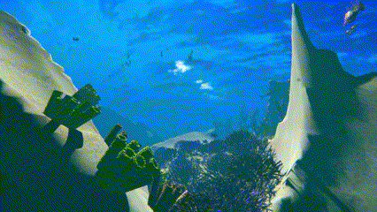
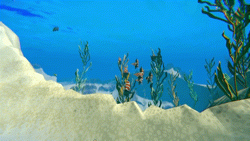

# ReefExplorer
Final project for B.S. degree. Developed by group consisting of three people, Reef Explorer is a 3D interactive procedurally generated simulation of infinite underwater world.

## Seabed
Seabed is generated in runtime based on 3D simplex noise. Mesh generation utilises Marching Cubes algorithm and Compute Shaders.

  

## Plants and Corals
All plants and corals are procedurally generated in Blender. Mesh generation take place in Geometry Nodes, while all textures are procedurally generated in shaders and then baked as images. All animations are done in Unity shaders.

  

## Fish
Fish movement is based on boids algorithm developed by Craig Reynolds. Calculations are performed in Compute Shaders and wobbling animation is done in shaders.

  

## Other effects
Water surface is a phisical plane featuring displacement to simulate waves, normal mapping for refraction and color vanishing with increasing depth. Additionally god rays are created using volumetric shading. Mist is used for color fading with distance.

  

## Collaborators
Project was developed with Kamil Bańkowski (https://github.com/xNetru) and Bartosz Kaczorowski (https://github.com/Bakaczor).

## Credits
- The `Nemo.FBX` model (originally named `FBX_Fish.FBX`) used in the project has been taken from https://github.com/UnityTechnologies/Test_ShaderGraphBlog repository developed by [John-O-Really](https://github.com/John-O-Really) which is licensed under [Creative Commons Attribution 4.0 International License](http://creativecommons.org/licenses/by/4.0/). 
